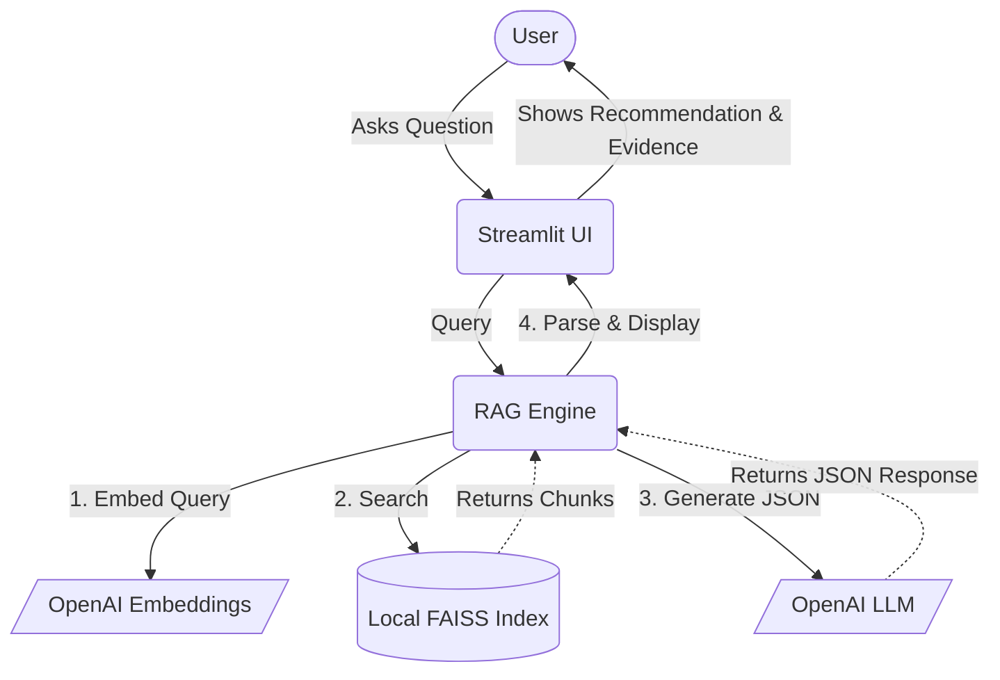

# ORGN 4210 — Week 07 RAG Lab (Streamlit)
## Leeds AI Policy Advisor

This starter project implements an **evidence-first RAG advisor** using:
- **OpenAI** (chat + embeddings)
- **FAISS** (local vector retrieval)
- **Streamlit** (UI)

### What this app enforces
- AI provides **recommendations**, not decisions
- Every answer must include **evidence citations**
- The response includes **tradeoffs, uncertainty, and an appeal path**

### Architecture



### Files
- `app.py` — Streamlit UI
- `rag.py` — retrieval + generation
- `indexer.py` — chunking, embedding, and indexing docs locally via FAISS
- `prompts.py` — structured JSON output contract
- `sample_docs/` — repository for your Leeds policy docs (markdown format)
- `vector_index.bin` & `metadata.json` — auto-generated by the indexer

### Environment Variables (required)
Create a `.env` file in the root directory with the following:
```
OPENAI_API_KEY=your_openai_api_key_here
PORT=8501  # Optional: defaults to 8501
```

### Run Instructions (Local)
We provide a `Makefile` to simplify common commands.

```bash
# 1. Install dependencies
make install

# 2. Run indexer to embed documents and create the local FAISS index
make index

# 3. Launch the Streamlit application
make run

# 4. Stop the local Streamlit application
make stop

# 5. Clean up local vector index and metadata
make clean
```

### Cloud VM Deployment Instructions

When deploying this application to a Cloud VM (e.g., Azure VM, AWS EC2, Google Compute Engine), it is recommended to use an isolated Python virtual environment.

```bash
# 1. Clone the repository and navigate to the directory
# git clone https://github.com/iportilla/ai-leeds.git
# cd ai-leeds

# 2. Create and activate a virtual environment named 'penv'
python3 -m venv penv
source penv/bin/activate

# 3. Install the dependencies
make install

# 4. Create your .env file
echo "OPENAI_API_KEY=your_key_here" > .env
echo "PORT=8501" >> .env

# 5. Build the FAISS vector index
make index

# 6. Run the application
make run
```
*Note: Ensure your Cloud VM's firewall rules allow inbound traffic on your configured `$PORT` to access the application externally.*

### Docker Deployment Instructions

If you prefer to run this application in a Docker container, a `Dockerfile` is provided. The Docker image handles dependency installation and automatically builds the FAISS vector index from the `sample_docs/` folder upon image build.

```bash
# 1. Create your .env file with your OpenAI API Key and Port
echo "OPENAI_API_KEY=your_key_here" > .env
echo "PORT=8501" >> .env

# 2. Build the Docker image
make docker-build

# 3. Run the Docker container
# This maps your local port to the container's port, and injects the .env file
make docker-run

# 4. Stop and remove the Docker container
make docker-stop
```

### Example Usage
Here are a few example questions you can try based on typical academic/policy documents:

- *"What happens if a student plagiarizes?"*
- *"Are there exceptions for late submissions due to medical emergencies?"*
- *"Who is the final decision owner for a disciplinary academic appeal?"*

**Example Response to: *"Are there exceptions for late submissions due to medical emergencies?"***

*   **Recommendation**: The policy documents do not explicitly grant an automatic exception for late submissions due to medical emergencies. A student must reach out to their instructor detailing the medical emergency, and the instructor holds the final decision on whether an exception or extension will be granted.
*   **Confidence**: `0.85%` (The policy does not explicitly mention medical emergencies, but standard exceptions apply)
*   **Tradeoffs**: 
    - *Granting the exception maintains fairness to students experiencing genuine hardship.*
    - *Being overly lenient may create an unfair advantage compared to students who submitted on time.*
*   **Evidence**: 
    - **`academic_integrity.md#chunk2`** — *"Instructors have the discretion to handle late submissions on a case-by-case basis..."*
*   **Decision Owner**: Course Instructor
*   **Appeal Path**: 
    - *Grade Appeal Process to Department Chair*
*   **Uncertainties**: 
    - *Is a doctor's note required for the extension?*
    - *How late can the submission be before an automatic failure is applied?*
*   **What Would Change My Mind**: 
    - *If evidence showed a specific medical exemption clause allowing a 48-hour grace period.*
